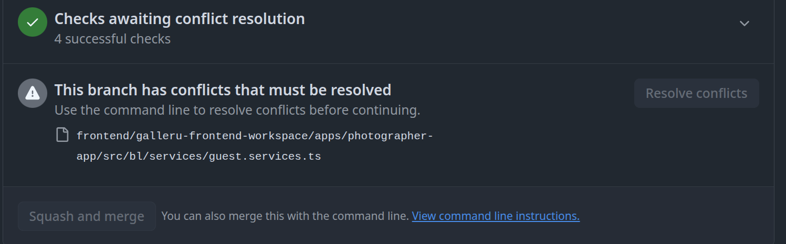

# Week 4 - Collaboration

## What are Git and GitHub?

*Git* is a version control system that helps you track changes in your code and collaborate with others.  
*GitHub* is a platform for hosting Git repositories online, making it easy to share code and work together.

---

## Task Recap


This document demonstrates how to use Git for branching, merging, resolving conflicts, and collaborating with others.


---

## Clone the Repository

```bash
git clone https://github.com/Avichai98/week4-collaboration.git

git status
On branch main
Your branch is up to date with 'origin/main'.
```

---

## Working with Branches

```bash
git checkout -b feature-a
Switched to a new branch 'feature-a'

git checkout -b feature-b
Switched to a new branch 'feature-b'

git status
On branch feature-b
nothing to commit, working tree clean

git branch
  feature-a
* feature-b
  main
```

---

### Add a File to `feature-b`

```bash
echo "Conflict feature-b" > conflict.txt

cat conflict.txt
Conflict feature-b

git add .

git commit -m "Conflict to feature-b"
[feature-b b943010] Conflict to feature-b 
 1 file changed, 1 insertion(+)
 create mode 100644 conflict.txt
```
- **b943010** is the short SHA-1 hash of the commit.
- **create mode 100644** means a new file was created with standard permissions (read/write for owner, read-only for group and others).

---

### Add the Same File to `feature-a`

```bash
git switch feature-a
Switched to branch 'feature-a'

echo "Conflict feature-a" > conflict.txt

cat conflict.txt
Conflict feature-a

git add .
git commit -m "Conflict to feature-a"
[feature-a 9cb5c3c] Conflict to feature-a
 1 file changed, 1 insertion(+)
 create mode 100644 conflict.txt
```

---

### Merge `feature-a` into `main`

```bash
git switch main
Switched to branch 'main'
Your branch is up to date with 'origin/main'.

git merge feature-a
Updating 2f50cbd..9cb5c3c
Fast-forward
 conflict.txt | 1 +
 1 file changed, 1 insertion(+)
 create mode 100644 conflict.txt
ls
README.md  conflict.txt

git merge feature-b
Auto-merging conflict.txt
CONFLICT (add/add): Merge conflict in conflict.txt
Automatic merge failed; fix conflicts and then commit the result.
```

---

### How to Solve a Merge Conflict

```bash
cat conflict.txt
<<<<<<< HEAD
Conflict feature-a
=======
Conflict feature-b
>>>>>>> feature-b

vim conflict.txt # or open the file in any editor

cat conflict.txt
Conflict feature-a
+
Conflict feature-b

git status
On branch main
Your branch is ahead of 'origin/main' by 1 commit.
  (use "git push" to publish your local commits)

You have unmerged paths.
  (fix conflicts and run "git commit")
  (use "git merge --abort" to abort the merge)

Unmerged paths:
  (use "git add <file>..." to mark resolution)
        both added:      conflict.txt

no changes added to commit (use "git add" and/or "git commit -a")

git add conflict.txt

git commit
[main 3724ba4] Merge branch 'feature-b'
```

---

### Rebase Example


```bash
git switch feature-a
Switched to branch 'feature-a'

cat conflict.txt
Conflict feature-a

git rebase main
Successfully rebased and updated refs/heads/feature-a.

cat conflict.txt
Conflict feature-a
+
Conflict feature-b
```

### Graph tree before rebase here.
```bash
git log --oneline --graph --all
* 700c76c (main) main: add main.txt
| * 140a639 (HEAD -> feature-rebase-demo) feature-rebase-demo: add demo.txt
|/  
*   792088e (feature-a) Merge branch 'feature-b'
|\  
| * 87ef070 (feature-b) Conflict to feature-b
* | ed1d521 Conflict to feature-a
|/  
* e98e0e4 (origin/main) first commit
```


### Graph tree after rebase here.

```bash
git log --oneline --graph --all
* b84ae5d (HEAD -> feature-rebase-demo) feature-rebase-demo: add demo.txt
* 700c76c (main) main: add main.txt
*   792088e (feature-a) Merge branch 'feature-b'
|\  
| * 87ef070 (feature-b) Conflict to feature-b
* | ed1d521 Conflict to feature-a
|/  
* e98e0e4 (origin/main) first commit
```


---

### Show Conflict During Rebase

```bash
cat conflict.txt
Conflict feature-b + feature-a + c

git switch main
Switched to branch 'main'

nano conflict.txt

git add .
git commit -m "Updated conflict.txt by main"

cat conflict.txt
Conflict feature-b + feature-a + main

git switch feature-a
Switched to branch 'feature-a'

git rebase main
Auto-merging conflict.txt
CONFLICT (content): Merge conflict in conflict.txt
error: could not apply 1c1ee4a... updated conflict.txt
hint: Resolve all conflicts manually, mark them as resolved with
hint: "git add/rm <conflicted_files>", then run "git rebase --continue".
hint: You can instead skip this commit: run "git rebase --skip".
hint: To abort and get back to the state before "git rebase", run "git rebase --abort".
Could not apply 1c1ee4a... updated conflict.txt

vim conflict.txt

git status
interactive rebase in progress; onto 60a9f36
Last command done (1 command done):
   pick 1c1ee4a updated conflict.txt
No commands remaining.
You are currently rebasing branch 'feature-a' on '60a9f36'.
  (fix conflicts and then run "git rebase --continue")
  (use "git rebase --skip" to skip this patch)
  (use "git rebase --abort" to check out the original branch)

Unmerged paths:
  (use "git restore --staged <file>..." to unstage)
  (use "git add <file>..." to mark resolution)
        both modified:   conflict.txt

no changes added to commit (use "git add" and/or "git commit -a")

git add conflict.txt

git rebase --continue
[detached HEAD 82de7be] updated conflict.txt
 1 file changed, 1 insertion(+), 2 deletions(-)
Successfully rebased and updated refs/heads/feature-a.
```

---

## Viewing Commit History with `git log`

### 1. Show the commit history for all branches in a graph (compact view):

```bash
git log --oneline --graph --all
```
Example output:
```
* 82de7be (HEAD -> feature-a) updated conflict.txt
* 60a9f36 (main) Updated conflict.txt by main
* eb08b9a updating conflict.txt
*   3724ba4 Merge branch 'feature-b'
|\
| * b943010 (feature-b) Conflict to feature-b
* | 9cb5c3c Conflict to feature-a
|/
* 2f50cbd (origin/main, origin/HEAD) Initial commit
```

- This command shows a visual graph of all branches, with each commit on a single line.

---

### 2. Show the full commit history for all branches (detailed view):

```bash
git log --all
```
Example output:
```
commit 82de7be297a8365e9a594abc55fc281360e0804d (HEAD -> feature-a)
Author: Avichai <avichai.shchori@gmail.com>
Date:   Tue May 27 10:33:50 2025 +0300

    updated conflict.txt
...
```
- This command shows all details for every commit on all branches.

---

### 3. Show the commit history for all branches in a compact list:

```bash
git log --oneline --all
```
Example output:
```
82de7be (HEAD -> feature-a) updated conflict.txt
60a9f36 (main) Updated conflict.txt by main
eb08b9a updating conflict.txt
3724ba4 Merge branch 'feature-b'
9cb5c3c Conflict to feature-a
b943010 (feature-b) Conflict to feature-b
2f50cbd (origin/main, origin/HEAD) Initial commit
```
- This is a quick way to see all commits across all branches.

---

### 4. Show the commit history for the `main` branch only (detailed):

```bash
git log main
```
Example output:
```
commit 60a9f3658f6909e63e0c6e189a3be84ecbaf9bd8 (main)
Author: Avichai <avichai.shchori@gmail.com>
Date:   Tue May 27 10:35:16 2025 +0300

    Updated conflict.txt by main
...
```

---

### 5. Show the commit history for the `main` branch only (compact):

```bash
git log main --oneline
```
Example output:
```
60a9f36 (main) Updated conflict.txt by main
eb08b9a updating conflict.txt
3724ba4 Merge branch 'feature-b'
9cb5c3c Conflict to feature-a
b943010 (feature-b) Conflict to feature-b
2f50cbd (origin/main, origin/HEAD) Initial commit
```

---

**Summary:**
- `git log --all` — Full commit history for all branches (detailed).
- `git log --oneline --all` — Compact commit history for all branches.
- `git log main` — Full commit history for the `main` branch.
- `git log main --oneline` — Compact commit history for the `main` branch.

---

### Cherry-pick Example

```bash
git switch feature-b
Switched to branch 'feature-b'

cat conflict.txt
Conflict feature-b

git log --oneline
b943010 (HEAD -> feature-b) Conflict to feature-b
2f50cbd (origin/main, origin/HEAD) Initial commit

git switch main
Switched to branch 'main'

git cherry-pick b943010
Auto-merging conflict.txt
CONFLICT (add/add): Merge conflict in conflict.txt
error: could not apply b943010... Conflict to feature-b
hint: After resolving the conflicts, mark them with
hint: "git add/rm <pathspec>", then run
hint: "git cherry-pick --continue".
hint: You can instead skip this commit with "git cherry-pick --skip".
hint: To abort and get back to the state before "git cherry-pick",
hint: run "git cherry-pick --abort".

code .

cat conflict.txt
Conflict feature-b + feature-a + main

Conflict feature-b

git add conflict.txt
git cherry-pick --continue
[main 322f2f0] Conflict to feature-b after cherry-pick
 Date: Tue May 27 10:03:57 2025 +0300
 1 file changed, 1 insertion(+)

git status
On branch main
```

---

## Pushing Changes to the Remote

```bash
git push
Username for 'https://github.com': 
Password for 'https://Avichai98@github.com':

Enumerating objects: 19, done.
Counting objects: 100% (19/19), done.
Delta compression using up to 16 threads
Compressing objects: 100% (13/13), done.
Writing objects: 100% (18/18), 1.68 KiB | 1.68 MiB/s, done.
Total 18 (delta 1), reused 0 (delta 0), pack-reused 0
remote: Resolving deltas: 100% (1/1), done.
To https://github.com/Avichai98/week4-collaboration.git
   2f50cbd..322f2f0  main -> main
```

- **2f50cbd** is the old commit hash (before push).
- **322f2f0** is the new commit hash (after push).
- **main -> main** means you pushed changes from your local `main` branch to the remote `main` branch.

---

## Setting Upstream Branches

If you try to push a new branch and see this error:

```bash
git push
fatal: The current branch feature-a has no upstream branch.
To push the current branch and set the remote as upstream, use

    git push --set-upstream origin feature-a
```

Use the following command:

```bash
git push --set-upstream origin feature-a
```

This does two things:
1. **Pushes** your local `feature-a` branch to the remote repository (`origin`).
2. **Sets the upstream tracking**: It links your local `feature-a` branch to the remote `origin/feature-a` branch.  
   After this, you can simply use `git push` or `git pull` without specifying the branch name.

---

## Pull Requests

All open pull requests can be viewed in the GitHub UI:




---

## GitHub Actions

You can add actions to your repository by creating files in the `.github/workflows/` directory.

For example:  
[js-lint.yml](.github/workflows/js-lint.yml)


---

## Reflection

See [REFLECTION.md](REFLECTION.md) for more details.

---

## Summary: Cleaning Up Your Commit History with Interactive Rebase

Before submitting your work (for example, before opening a pull request), it’s a best practice to use **interactive rebase** to clean up your commit history. This helps make your changes easier to review and keeps the project history tidy.

### What is Interactive Rebase?

- **Interactive rebase** (`git rebase -i`) allows you to edit, reorder, squash (combine), or remove commits before merging or submitting a pull request.
- This is different from a regular rebase, which simply reapplies your commits on top of another branch without giving you the chance to edit or combine them.

### When should you use it?

Use interactive rebase when you have several small or messy commits that could be combined into a single, meaningful commit.  
For example, if you made several commits just to rename a variable:

1. Commit 1: name variable `x`
2. Commit 2: rename `x` to `y`
3. Commit 3: rename `y` to `z`

Instead of keeping all three commits, you can use interactive rebase to squash them into one clean commit, such as:  
`Use variable z for calculation`

### How to use interactive rebase

If you want to combine your last 3 commits:

```bash
git rebase -i HEAD~3
```

- This opens an editor where you can choose to squash, edit, or reorder the commits.
- After saving and closing the editor, you can write a new, clear commit message.

If you want to clean up all commits on your branch that are not in `main`:

```bash
git rebase -i main
```

You can also use it to edit commit messages, reorder commits, or drop unnecessary ones.


for exmaple:
```bash
yosef@yosef-ThinkBook-14-G4-IAP:~/Documents/github/week4-colaboration/week4-collaboration$ git log --oneline --graph --all
* 51f576d (HEAD -> new-clean-feature) add clean rebase example
* daf612d (origin/main, origin/HEAD, main) Add examples of graph tree before and after rebase in README.md
*   5c73a9d Merge branch 'main' of https://github.com/Avichai98/week4-collaboration
|\  
| *   368fd96 Merge pull request #1 from Avichai98/feature-a
| |\  
| | * 82de7be (origin/feature-a) updated conflict.txt
* | | 8493b89 Refactor code structure for improved readability and maintainability
|/ /  
* | 7d71491 Update README.md
* | b5abf2f fix 2 syntax issues
* | 93642b1 add js
* | e8d641d change to workflow dir
* | 9164e58 .
* | 3f8588d add action
* | e4ba0cc Adding REFLECTION.md
* | 322f2f0 Conflict to feature-b after cherry-pick
|/  
* 60a9f36 Updated conflict.txt by main
* eb08b9a updating conflict.txt
*   3724ba4 Merge branch 'feature-b'
|\  
| * b943010 (origin/feature-b) Conflict to feature-b
* | 9cb5c3c Conflict to feature-a
|/  
* 2f50cbd Initial commit
yosef@yosef-ThinkBook-14-G4-IAP:~/Documents/github/week4-colaboration/week4-collaboration$ git rebase -i main
[detached HEAD e3cf5e6] this is test for chnage commit message
 Date: Wed May 28 15:24:50 2025 +0300
 5 files changed, 102 insertions(+)
 create mode 100644 .idea/indexLayout.xml
 create mode 100644 .idea/projectSettingsUpdater.xml
 create mode 100644 .idea/vcs.xml
 create mode 100644 .idea/workspace.xml
 create mode 100644 newfile.txt
Successfully rebased and updated refs/heads/new-clean-feature.
```

---

## Repository Overview

This repository, `week4-collaboration`, demonstrates effective teamwork using Git and GitHub.  
Both Avichai and Yosef contributed from their own computers, regularly sharing and integrating each other's changes using Git's collaboration features.  
We used branches, merging, rebasing, and pull requests to coordinate our work, resolve conflicts, and keep our project history clear.  
The README provides step-by-step instructions and best practices for collaborative development.


